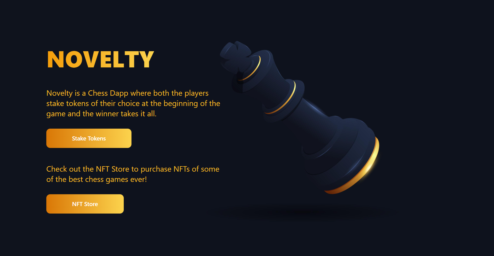
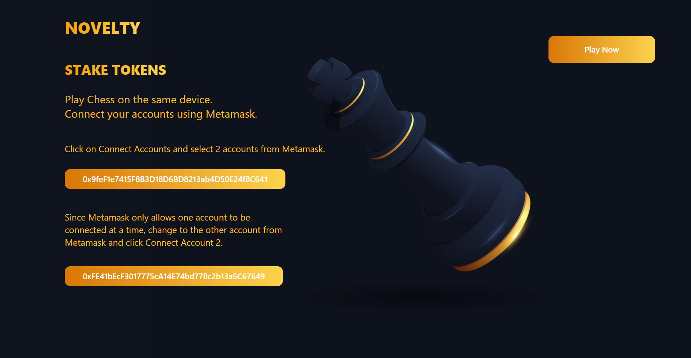
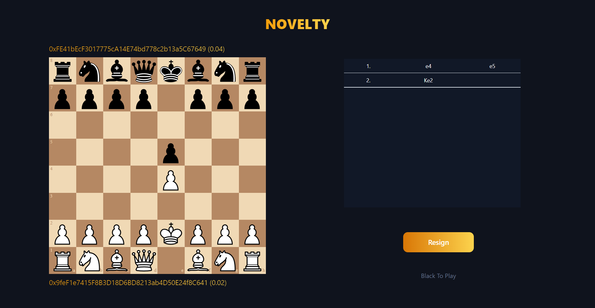
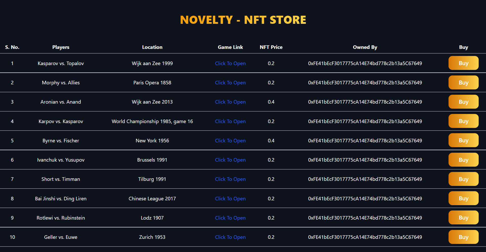

<h1 align="center">Novelty - The Chess Dapp ♚</h1>

    <a href="https://noveltychess.netlify.app/">View Website</a>

Novelty is a Chess Dapp where both the players stake tokens of their choice at the beginning of the game and the winner takes it all. It also has an NFT Store where users can purchase NFTs of some of the best chess games ever.

## Technologies Used

## Features

* [Stake Tokens](#stake-tokens)
* [NFT Store](#nft-store)

## Stake Tokens

 
Both players can stake tokens of their choice using MetaMask at the beginning of the game and the winner takes it all.
 

## NFT Store

 
User can use NFT Store to purchase NFTs of some of the best chess games ever played.